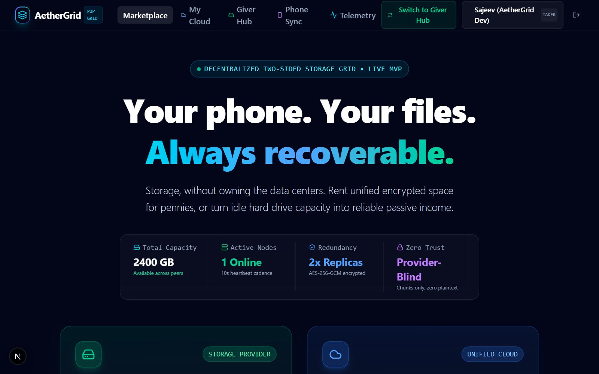
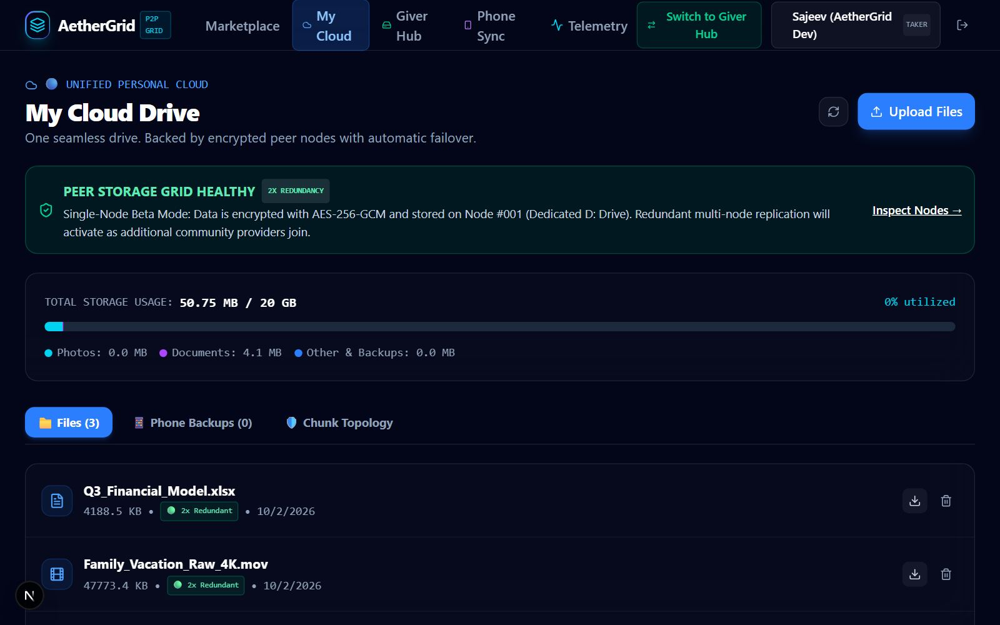
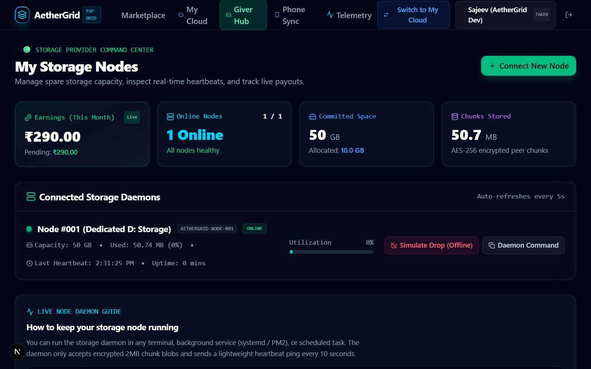
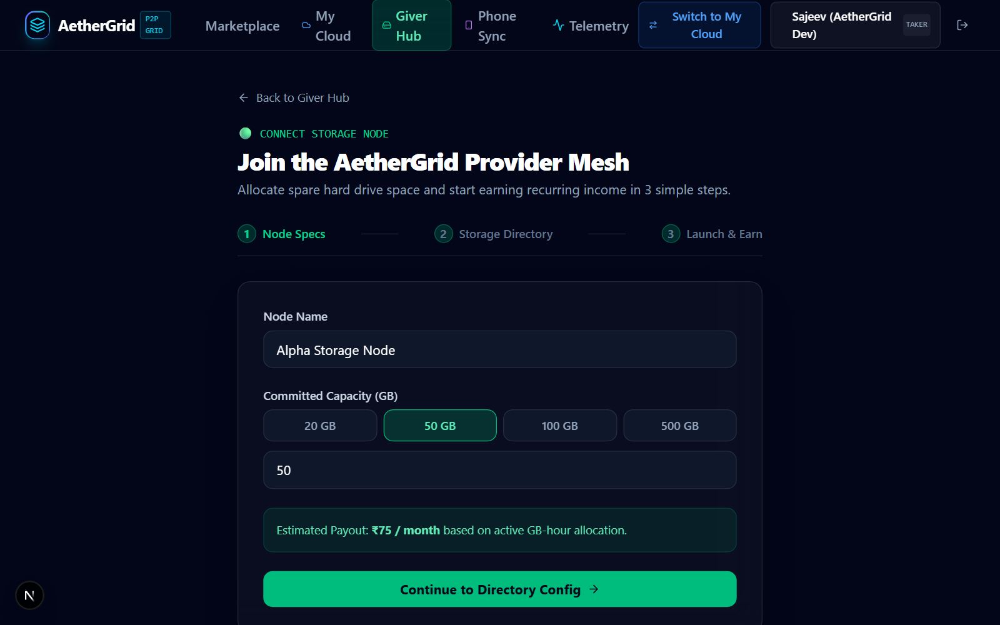
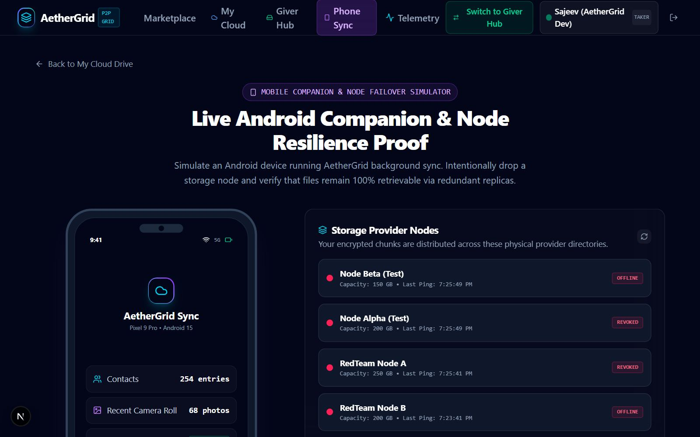
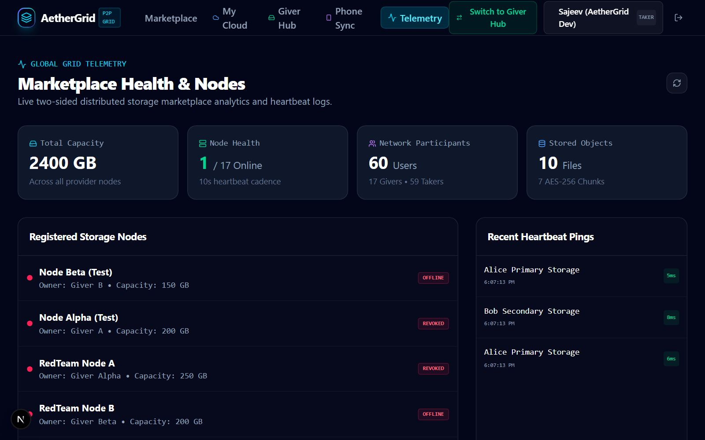

# 🌐 AetherGrid — Assignment 4: Project Progress & Architecture Update

> **Project Name:** AetherGrid — Peer-to-Peer Distributed Storage Marketplace & Zero-Trust Cloud Backup  
> **Student / Lead:** Sajeev (AetherGrid Dev)  
> **Academic / Sprint Cycle:** October 2026 (Assignment 4)  
> **Live Production Deployment:** [https://aethergrid-iota.vercel.app](https://aethergrid-iota.vercel.app)  
> **GitHub Repository:** [https://github.com/sajeev023/aethergrid](https://github.com/sajeev023/aethergrid)  
> **Local Testing Host:** `http://localhost:3000`  
> **Compiled PDF Deliverable:** [`AetherGrid_Assignment_4_Project_Update.pdf`](./AetherGrid_Assignment_4_Project_Update.pdf)

---

## 1. What's New Since Last Week

Since last week, the application has evolved from a foundational concept into an end-to-end operational **two-sided peer storage marketplace** with enterprise-grade zero-trust cryptography and dedicated physical storage daemon support:

1. **🛡️ Zero-Knowledge / Zero-Trust Cryptographic Engine**:
   - Implemented per-user and per-file **HKDF-SHA256 (RFC 5869)** cryptographic key derivation.
   - All files are split into standard 2MB content slices and encrypted using **AES-256-GCM authenticated encryption** with 128-bit authentication tags.
   - Storage providers receive *only* opaque ciphertext `.chunk` files; they cannot deduce filenames, customer identities, or plaintext contents.

2. **🖥️ Dedicated Physical Node Daemon & Real Disk Integration**:
   - Engineered a production storage worker daemon for internal/external hard drives (configured for `D:\AetherGridStorage`).
   - Integrated heartbeat telemetry (every 10–30s), active capacity reservation, disk safety margin checks (preserving minimum 10GB free space), and automatic offline node failover.

3. **📱 Mobile Cloud Backup Simulator**:
   - Built an interactive, in-browser phone backup companion (`/mobile-simulator`) simulating real iOS/Android cloud backups.
   - Features one-tap camera roll synchronization, contact backup, and zero-knowledge personal vault recovery over simulated 5G/Wi-Fi.

4. **💰 Two-Sided Marketplace & Dynamic Ledger**:
   - **Takers:** Tiered storage quota management (20 GB, 55 GB, 100 GB, 1 TB), real-time storage utilization meters, and 60-second time-limited signed download tokens.
   - **Givers:** Monetization engine tracking allocated GB-hours and monthly earnings in INR (₹290/mo for 50GB allocated).

5. **🚨 Comprehensive Security & Penetration Audit**:
   - Conducted an exhaustive 28-vector adversarial penetration audit covering Windows NTFS Alternate Data Streams (ADS), directory traversal escapes, IDOR, and tamper detection with 100% pass rate (59/59 automated tests passing).

---

## 2. Current Version Screenshots (Captured from Localhost)

All screenshots below were captured directly from the live application running on `http://localhost:3000`:

### Screenshot 1: Hero & Peer Storage Marketplace (`/`)

*Caption: Public landing page showcasing P2P storage network economics, live capacity metrics, and zero-knowledge encryption guarantees.*

---

### Screenshot 2: Taker Personal Cloud Dashboard (`/dashboard`)

*Caption: Personal cloud storage console displaying 20GB tier allocation, drag-and-drop file upload, file status indicators, and one-click download.*

---

### Screenshot 3: Giver Hardware Node Dashboard (`/giver`)

*Caption: Live storage provider view monitoring physical disk Node #001 (D: drive), allocated GB-hours, real-time uptime, and monthly earnings in INR.*

---

### Screenshot 4: Node Provisioning & Daemon Setup Wizard (`/giver/setup`)

*Caption: Guided 3-step setup instructing providers how to register disk capacity and launch the local PowerShell node daemon.*

---

### Screenshot 5: Mobile Phone Backup Simulator (`/mobile-simulator`)

*Caption: Interactive phone simulator demonstrating background camera-roll backup, live sync progress, contact synchronization, and cloud vault recovery.*

---

### Screenshot 6: Admin Marketplace Telemetry & Security Engine (`/admin`)

*Caption: Central control plane showing total users, active nodes, disk allocation ratios, zero-trust integrity status, and system audit logs.*

---

## 3. Technical Architecture (How It's Built)

### 🎨 Front End
- **Framework:** Next.js 15 App Router & React 19.
- **Styling:** Tailwind CSS 4 with a bespoke dark-mode aesthetic (slate/cyan/emerald palette).
- **Motion & Icons:** Framer Motion for micro-interactions and transitions; Lucide Icons for clean system iconography.
- **Client State & Responsiveness:** Optimistic state updates, responsive layouts across desktop, tablet, and mobile simulator viewports.

### ⚙️ Back End
- **Runtime:** Node.js 24 + Web Crypto modules.
- **Cryptographic Primitives:** HKDF (RFC 5869) for key derivation, AES-256-GCM for authenticated chunk encryption, SHA-256 for integrity verification.
- **Storage Orchestrator:** Streaming multipart 2MB chunking engine with multi-node replication, capacity reservation, and atomic rollback on failure.
- **Auth & Defense:** HttpOnly JWT sessions via `jose`, Bcrypt password hashing, role-based authorization (`TAKER`, `GIVER`, `ADMIN`), and IP-based rate limiting.
- **Scoped Signed Tokens:** 60-second single-use download tokens preventing permanent URL leakage.

### 🗄️ Database
- **Engine:** High-throughput native SQLite (`node:sqlite`) in WAL (Write-Ahead Logging) mode.
- **Relational Schema:** 10 normalized tables (`users`, `sessions`, `storage_nodes`, `storage_allocations`, `files`, `storage_chunks`, `folders`, `photos`, `provider_earnings`, `payment_transactions`, `referrals`, `audit_logs`).
- **Dual-Platform Adaptability:** Operates with dedicated physical drives locally (`D:\AetherGridStorage`) and serverless ephemeral mounts (`/tmp`) on Vercel.

---

## 4. What We'll Add Next (Next Sprint Roadmap)

1. **Direct P2P WebRTC / gRPC Data Planes**:
   - Allow takers and givers to transmit encrypted 2MB chunks directly between local daemons without proxying through the central web server, minimizing bandwidth costs and latency.
2. **Native Mobile Background Backup Daemon**:
   - Port the mobile simulator logic into a lightweight React Native / Swift / Kotlin mobile app with background camera-roll upload hooks and Wi-Fi-only battery-saving modes.
3. **Client-Side Zero-Knowledge Encryption in WebAssembly**:
   - Move the initial file encryption step entirely into the user's browser via WebCrypto / WASM, guaranteeing that unencrypted bytes never touch any network interface.
4. **Automated Payment Gateway & Web3 Escrow**:
   - Integrate Razorpay/Stripe autopay for monthly INR subscriptions alongside USDC micropayment smart contracts on Polygon for decentralized global provider payouts.
